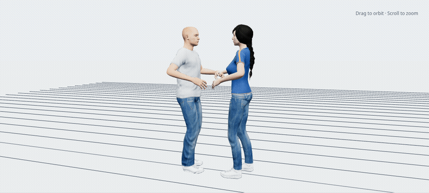
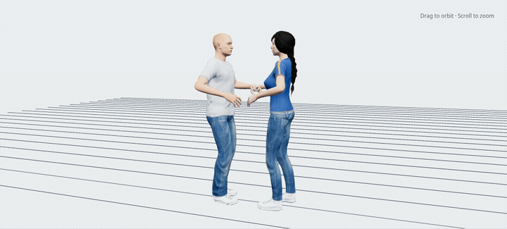

# New York Hustle hand-contact polish

Local review prepared by Codex on October 4, 2026 for
[issue #8](https://github.com/SanjoSolutions/dance-animations/issues/8).
Baseline: `7b8535fa37873dca51ac9f07b85e82918d5fa9b3`.

The 40 New York Hustle studies now have cupped finger grips, relaxed released
hands, planned reconnections, and raised hand contacts during underarm turns.
Each native source has a regenerated deformation bake and paired GLB. The
catalog retains the saved-source draft status and explicitly identifies the
hand-contact polish as a procedural study.

## Native authoring

The shared Rigify wrist and finger limits use anatomical custom spaces. Portable
scene reconstruction now restores their missing reference objects, keeping the
original constraint bounds and shared rotation modes. Finger posing keys the
native quaternion controls used by the current rigs.

`HandPose`, `GripTiming`, and `HustlePolish` compose calibrated palm placement,
contact/release timing, and source authoring. Contacts include single and double
holds, same-heading positions, hand changes, releases for passes/free spins,
and overhead arcs. The double turn and inside turn pass also use the follower's
native right elbow pole and forearm-aligned wrist orientation. This keeps their
rapid rotations inside the native wrist limits. Additional keys resolve the
turn arcs and reconnection intervals; these two fast turns use frame samples.
Quaternion keys follow a consistent hemisphere between final authored poses.

The body-channel comparison against the baseline preserves every original key,
handle, and interpolation setting outside the hand/finger controls and those
two follower elbow-pole location curves. Original foot, hip, torso, and head
keys, participant slots, tempo, counts, descriptions, and loop metadata remain
in place. Standard MPFB characters and the shared deformation rigs supply the
preview and export.

## Validation stages

The adjacent [evidence JSON](new_york_hustle_hand_polish/evidence.json) records
original and current source/export hashes and per-clip measurements.

All 40 saved sources passed 9,112 half-frame samples. The greatest full-contact
palm gap was 10.02 mm; the greatest wrist step was 20.38 degrees per half-frame.
The largest deformation-bake matrix-component difference was 0.0000155.
`npm run check`, all 39 tests, and `npm run build` passed. After rebasing onto `044615a`, the corrected fast turns, native authoring
save/reopen workflow, and paired browser playback passed again. The anatomical-space
regression and native authoring save/reopen test also passed.

1. **Authored controls:** full-contact palm positions resolve within 12 mm at
   authored poses. Native joint limits remain active. Cached original hand
   controls make subsequent refinement start from the original blocking.
2. **Saved source playback:** reopen every source and sample every half-frame.
   Require finite deformation matrices, palm separation below 25 mm during
   full contact, and wrist rotation changes below 0.6 radians per half-frame.
   Compare all preserved body channels and timing metadata against the baseline.
3. **Deformation bake:** compare all 418 deformation bones across both performers
   at every integer frame. The matrix-component tolerance is 0.0001.
4. **Runtime export:** compact the paired native bakes, apply lossless meshopt
   compression, validate embedded action names, performer targets, durations,
   and source hashes, and run the complete player test suite.
5. **Visual review:** seek through 61 browser poses each for the underarm right
   turn, follower double turn, inside turn pass, and side break. Review the
   clothed standard MPFB characters and the browser's exported draft label.

This review covers hand-contact geometry and rotation continuity. Existing
procedural footwork and body blocking retain their draft technique status;
dance instruction certification and a repertoire-wide collision audit remain
outside this hand polish.

### Browser previews





## Reproduction

Use Blender 5.2 with the repository helpers:

```sh
blender --background --factory-startup --python-exit-code 1 \
  --python scripts/new_york_hustle/polish.py -- --defer-catalog
python scripts/new_york_hustle/sync_catalog.py
```

The author writes one result per clip under `.cache/hustle-polish/`. For separate
workers, supply disjoint clip IDs after `--defer-catalog` and distinct log files.
Sync the catalog after all workers finish. Supply the same clip IDs to
`scripts/optimize_clips.py` and `scripts/compress-clips.mjs` to compact and
compress the regenerated GLBs.

```sh
blender --background --factory-startup --python-exit-code 1 \
  --python scripts/new_york_hustle/validate.py
blender --background --factory-startup --python-exit-code 1 \
  --python scripts/player_assets/animation_joint_frames.test.py
npm run check
npm test
npm run build
```

The validator uses the recorded baseline commit and writes cumulative per-clip
results under `.cache/hustle-polish/validation.json`. Subset validation merges
successful results; the evidence JSON binds this review to specific asset hashes.
