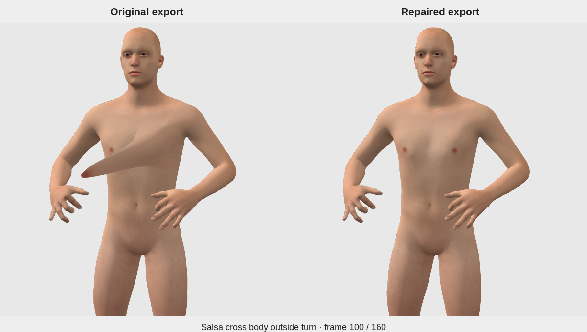

# Salsa cross body outside turn: chest deformation repair

Local quality review for [issue #14](https://github.com/SanjoSolutions/dance-animations/issues/14), October 4, 2026.

The Man's left chest translation was constant in the runtime GLB while the
torso traveled and turned. The saved native control action evaluates both chest
deformation bones correctly. This repair replaces the Man's `DEF-breast.L`
translation with 161 evaluated source positions, sampled at every stored frame
from 0 through 160 at 24 FPS. The resulting track follows the torso throughout
the 6.6667-second directed move.

All 1,259 other channels retain their decoded sample times and values. Both
performers retain their choreography, skeleton hierarchy, animation name, and
duration. Encoding also supplies the standard Meshopt fallback buffer metadata.
The editable Blender source, shared rigs, catalog provenance, inventory hashes,
and **Saved-source draft preview** status retain their recorded revision.

## Evidence

[The measured report](salsa_issue_14/evidence.json) records source/export and
dependency SHA-256 hashes, Blender/helper revisions, sample coverage, units,
tolerances, and stage-specific coverage.

| Measurement | Original | Repaired |
| --- | ---: | ---: |
| Maximum chest-bone drift in torso space | 0.965194 m | 0.0000164 m |
| Maximum chest-surface drift in torso space | 0.965194 m | 0.0000247 m |
| Maximum runtime error against native position at integer frames | 0.965195 m | 0.000000224 m |

Surface measurements cover 116 Man base-body vertices with left-chest weight
above 40%, at 641 quarter-frame poses. Latin outfit chest body vertices are
masked by clothing; its skeleton receives the same complete pose coverage.
The regression test checks both chest joints on both performers with base and
Latin models, including the directed endpoint. It fails against the original
asset and passes against the repaired asset.

Fresh source playback used Blender 5.2.2 through `scripts/open_studio.py` and
the native animation chooser. Chromium/Three.js visual review used the actual
MPFB base mesh at frames 0, 40, 80, 100, 120, and 160, with the camera following
torso heading. The comparison above records frame 100.

The runtime track uses the same integer-frame interpolation as the existing
clip. Fractional native-versus-runtime position error reaches 3.3315 mm while
torso-relative chest attachment stays within 0.025 mm. The source's procedural
study status and historical choreography/contact review remain applicable.
This focused repair retains the saved-source preview workflow; native Action
Bakery bake fidelity and broader dance acceptance belong to separate coverage.

## Validation and publication

- `npm run check`: passed, including 3,582 runtime variants, 3,500 source hashes,
  music attribution, and licensing. The slow-dance routine LFS source was
  hydrated before the final check.
- `npm test`: all 40 tests passed.
- `npm run build`: passed, packaging all 3,582 runtime variants.
- `git diff --check` and `python scripts/lfs_policy.py check`: passed.

Delivery covers one runtime clip, its regression test, and this quality review.
Publication to `main` follows user approval of this local review under
[the repository policy](../../AGENTS.md).
